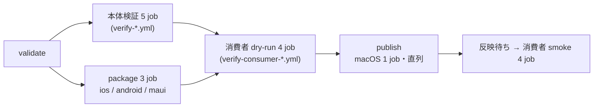

# release workflow (4 形態の一斉公開)

この文書を読むと、`.github/workflows/release.yml` が version を 1 つ受け取ってから 4 形態の配布物を公開レジストリへ出し終えるまでに何をどの順で行い、途中で失敗したときに何が残り、どう続きを埋めるかが分かる。配布物そのものの中身と version の決まり方は [配布物の構成](distribution-artifacts.md)、publish の前後に配布物を利用者と同じ経路で解決する検証は [消費者検証](consumer-verification.md) を先に読むと分かりやすい。オーナーが手で行う設定 (Environment・secrets・branch protection) と起動・再試行の手順は規範として [リリース手順](../../../handbook/cross/release-procedure.md) が持ち、この文書は workflow の側から仕組みを記述する。

本文で使う語のうち、monorepo・配信リポジトリ・facade / binding・artifact・枠・deployment・印・本体検証は末尾の用語表で定義する。

## 起動と入力

release は `workflow_dispatch` で起動し、version と `dry-run` の 2 入力を受ける。version の SSoT はこの入力で、tag と各レジストリの version はすべてこの文字列になる ([cross/ADR-0024](../../../decisions/cross/0024-release-dispatch-serial-publish-spm-tag-before-kmp.md))。

| 入力・条件 | 内容 |
|---|---|
| version | `X.Y.Z` または `X.Y.Z-{alpha\|beta\|rc}.N` (先頭ゼロなし)。形式外はソースを取得する前に失敗する |
| dry-run | true なら publish 以降 (publish・反映待ち・smoke) を行わず、起動ブランチの制限も外れる。配信先の状態は一切変わらない |
| 起動ブランチ | 本番 (dry-run が false) は `main` からだけ。secrets を置く Environment `release` も `main` からの参照に限られる |
| 排他 | concurrency group `release` でリポジトリ全体で 1 本ずつ流す。進行中の実行は打ち切らないが、待ち行列に残るのは最新の 1 件で、先に待っていた dispatch は黙って取り消される |
| 権限 | workflow の既定は `contents: read`。publish job だけが Environment `release` と `contents: write` + `id-token: write` を持ち、再利用可能 workflow の呼び出しに `secrets: inherit` は使わない |

リリース固有の値 (Maven 座標 3 本・NuGet ID 3 本・配信リポジトリ名・artifact 名・Central Portal の URL) は workflow 冒頭の `env` に集約され、同型のリリースを別リポジトリへ持っていくときはここだけを差し替える。

## 段の構成

段は 6 つで、反映待ちと smoke を最後の 1 段に数える。

| 段 | 何をするか |
|---|---|
| validate | checkout より前に version 形式と起動ブランチを検査し、checkout 後に monorepo の同名 tag (無し / 同 commit → 続行、別 commit → 失敗) と配信リポジトリの同名 tag (その tag が指す内容が今回のスナップショットと同じなら続行、違えば失敗。`check-distribution-tag.sh`) を見る。Release ノートの収集・検査・整形もここで一度だけ行う (「Release ノートの組み立て」) |
| 本体検証 | 検証 CI と同じ再利用可能 workflow 5 本 (`ios` / `android` / `android-instrumented` / `kmp` / `maui`) をそのまま呼ぶ |
| package | iOS のスナップショット (ubuntu)、Android の Maven ローカル発行物 (macOS)、MAUI の nupkg / snupkg (macOS) を version を注入して作り artifact に保存する。KMP の配布物はここでは作らない |
| 消費者 dry-run | `verify-consumer-{ios,android,maui,kmp}.yml` を `mode: dry-run` + version + package 段の artifact で呼ぶ。KMP の消費者には Android の artifact を渡し、kmp/ の発行は消費者 job 内で行う |
| publish | 本体検証 5 + dry-run 4 + validate がすべて成功したときだけ走り、配信先へ書き込む (次節) |
| 反映待ち・smoke | 公開レジストリのミラーへの同期を待ってから、同じ消費者検証 workflow 4 本を `mode: smoke` + version で呼ぶ |

package 段で KMP を作らないのは、KMP の配布物が Swift 参照に配信リポジトリの https URL と同版の `exact` を焼き込み、その発行に同版の tag の実在が要るためである。dry-run の消費者 job は、配信リポジトリのスナップショット (配布物の構成の文書で定義した `ios/` の写し) を作業ディレクトリで git 初期化して同版の tag を打ったローカル clone を作り、Swift 参照をその `file://` URL に上書きして kmp/ を発行し直す。そのため package 段に KMP の成果物があっても消費者は居ない。

publish job が macOS なのは、KMP の iOS publication の発行に Xcode が要るためである。Android の package job も publish と同じ macOS で作るのは、publish が署名鍵つきで再ビルドした発行物を package 段のものと比較する (「dry-run が見たものと外に出るものが同じ」) ために、比較の前提 (同じ OS・同じ JDK・同じ commit) を保つためである。

## publish の順序

publish は macOS runner の 1 job で、取り消せる操作を先に、取り消せない操作 (nuget.org への push・Maven Central の release) を後に並べて直列に進む。配信リポジトリの tag だけは、KMP の発行がその tag の実在を要求するため、取り消せない操作より前に生まれる例外になる。

| 順 | ステップ | 失敗したときに残るもの |
|---|---|---|
| 0 | 外部状態の再検査と続行判定 (次々節)、artifact の download、nupkg 名の検査 | なし |
| 1 | 配信リポジトリへスナップショット commit を push (差分なしなら skip) | なし |
| 2 | Android を署名つきで再ビルド → package 段の発行物との同一性比較 → `.asc` の検査 → Maven Central へ upload 保留 → 検証済み (VALIDATED) 待ち | 保留 deployment (drop される) |
| 3 | 配信リポジトリへ tag を push (内容一致なら skip) | tag |
| 4 | KMP を https + `exact` で発行 → `.asc` の検査 → upload 保留 → 検証済み待ち | tag + 保留 deployment 2 件 (drop される) |
| 5 | nuget.org へ push (binding 2 件 → facade の順。facade が見える時点で依存先が揃うように。`--skip-duplicate`) | 公開済みのパッケージ (取り消せない) |
| 6 | Maven Central の release を Android → KMP の順に要求 (KMP の Android publication が `ksdialogs-core` に同版依存するため、依存先を先に公開する) してから、2 枠の公開 (PUBLISHED) をまとめて待つ | 公開済みの座標 (取り消せない) |
| 7 | monorepo の tag と GitHub Release (本文は validate が確定させた成果物。version の表記によらず prerelease の印は付けず `--latest` を明示する) | tag と Release (残す) |

Android の同一性比較は署名ファイルとチェックサムを除き、アーカイブはエントリ名と内容で比べる (`compare-maven-artifacts.sh`)。KMP は publish 段でしか作らないため比較の対象外で、代わりに smoke が公開レジストリからの実解決で確かめる。署名鍵が届いていなければ Android の `.asc` 検査 (順 2) で止まり、配信リポジトリの tag も KMP の発行も NuGet push も起きない。

失敗したとき、drop できる状態 (VALIDATED / FAILED) の deployment は 2 枠とも drop され、検証中・公開処理中の deployment は ID を残して次の再試行に委ねる。

## Maven Central の 2 枠 deployment

android/ と kmp/ は別ビルドで、Maven Central の upload は Gradle ビルド単位に 1 deployment を作る。workflow は deployment を「枠」(`android` / `kmp`) として持ち回る。deployment の状態は upload 後に検証中 (VALIDATING) → 検証済み (VALIDATED) と進み、release 要求で公開処理中 (PUBLISHING) → 公開済み (PUBLISHED) になる。検証に落ちると FAILED、drop すると消えて NOT_FOUND になる。

| 項目 | 内容 |
|---|---|
| ID の取得と保存 | upload ログの `deployment id:` から抽出し、1 つの artifact に枠ごとのファイルとして保存する。同じ run の再試行はこの artifact から前回の ID を読む。ID が得られなければ失敗する |
| 検証待ち | 各枠の upload 直後に VALIDATED を待つ (上限 30 分)。FAILED や上限超過なら失敗し、NuGet push へ進まない |
| release と公開待ち | release 要求そのものは即時に返り、時間を使うのは公開待ちだけである。2 枠の検証待ちは NuGet push より前に済んでいるので、release 段は要求 (Android → KMP) の後、要求した枠と再試行で引き継いだ公開処理中の枠をまとめて 1 本で待つ (上限 90 分、`central-portal.sh wait-published`) |
| 自動公開の抑止 | 両 build root が `publishToMavenCentral(automaticRelease = false)` を明示し、Gradle プロパティで自動公開に倒れない |
| 枠の見分け | Central Portal の一覧では 2 枠とも `jp.kamusoft-<version>` の名前で並ぶ。枠の区別は publish job の最後のサマリ step (Summarize) が出す deployment ID で行う |

再試行で枠の前回 ID があるときの動作は `central-resume.sh` が状態から決める (実レジストリなしで自己テストできる形に切り出してある)。

| 前回 deployment の状態 | 動作 |
|---|---|
| VALIDATED | upload を skip して release へ |
| PUBLISHING | release を送り直さず、公開待ちの step で PUBLISHED を待つ |
| PUBLISHED | upload も release も skip |
| FAILED | drop してから再 upload |
| NOT_FOUND / ID なし | 再 upload |

## 再試行と続行の判定

publish の各ステップは存在検査で冪等になっていて、失敗した run を同じ version で「失敗した job から再実行」(GitHub の Re-run failed jobs。run id は変わらず試行回数だけ増える) すれば、済んだ分を飛ばして続きを行える。続きを埋めてよいかは、書き込みを始める前の外部状態の再検査で、次の順に決める。

1. **monorepo の tag を見る。** 起動 commit と別の commit を指していれば失敗する。起動 commit にあれば完了印とみなし、レジストリと配信リポジトリへの publish をすべて skip して GitHub Release の作成 (既存なら触らない) だけを行う。tag が無ければ 2 へ
2. **当該 version の外部状態 (配信リポジトリの tag・Maven Central の公開・nuget.org の存在) を見る。** 1 つも無ければ進む。このとき「無の状態から publish に入った」印 (version・commit・run id) を artifact に残す。1 つでもあれば 3 へ
3. **印を見る。** 印が今回の version・commit・run と一致すれば続きを埋める (resume)。印が無い・一致しなければ失敗する — 新規の dispatch (試行 1 回目で外部状態がある) と、外部状態を理由に拒否された run の再試行がここに当たる。公開済みの binary と tag が指す source の対応を保証できないため

判定は `check-resume-eligibility.sh` に切り出され、試行回数 × tag の状態 × 外部状態 × 印の組み合わせを自己テストが網羅する。nuget.org の照会は 200 / 404 / それ以外を分け、判定不能を「未公開」と読み替えない (fail-closed)。

完了印のある再試行が行うのは Release の作成だけで、既に Release があれば本文にも触れない。本文は validate が確定させた成果物から取るため、再実行しても内容は変わらない。

KMP 以降で失敗した version を再試行せずに放棄すると、配信リポジトリに「iOS だけ解決できる tag」が残る。番号は欠番にして再利用せず、tag の削除は任意の後片付けにすぎない。

## Release ノートの組み立て

GitHub Release の本文は、`main` 宛ての pull request 本文の `## Changes` 節から `scripts/release/build-release-notes.py` が組み立てる ([cross/ADR-0028](../../../decisions/cross/0028-release-notes-from-main-pull-request-body.md))。収集・検査・整形は validate の段で一度だけ行い、確定した本文を artifact で publish へ渡す。publish は pull request 本文を読み直さない — 段をまたいで本文を読み直すと、不可逆な公開の後に Release の作成だけが失敗する経路と、検査したものと違う本文で Release が作られる経路の両方ができるためである。

| 項目 | 内容 |
|---|---|
| 対象の範囲 | 起点 tag から対象 commit までの commit に紐づく pull request のうち、base が `main` のもの。起点 tag は「今回の version でなく、公開済みで、`main` の first-parent 上で対象 commit の祖先である Release」のうち最も近いもの |
| 入力の文法 | `## Changes` はちょうど 1 つ。節の非空行はすべて `- <種別>: <説明>` (種別は breaking / feature / fix / docs) か単独の `- none`。認識できない行は読み飛ばさず失敗させる (静かに項目が消えると誰も気づけない) |
| リハーサル | `main` から起動した dry-run は収集から成果物の受け渡しまで本番と同じ経路を通る (Release だけ作らない)。`main` 以外からの起動では収集も検査も行わない (pull request に紐づかない commit が範囲に入るため) |

利用者向け文書 (ルート README 2 枚と `skills/` 配下の Agent Skills) のインストール例は具体 version を持たず、release はその行を書き換えない ([cross/ADR-0027](../../../decisions/cross/0027-install-examples-without-pinned-version.md)・[cross/ADR-0030](../../../decisions/cross/0030-release-does-not-write-back-install-examples.md))。最新版の案内は `/releases/latest` に委ねており、release が Release に prerelease の印を付けず `--latest` を明示するのはこの案内先を解決させるためである。例が守る形は handbook の [インストール例の契約](../../../handbook/cross/install-examples.md) が持ち、日常の検証 CI がその契約を検査する。

## 反映待ちと smoke

publish 直後は、Maven Central も nuget.org も利用者が解決に使うミラー (`repo1.maven.org` / nuget.org の flat container) に現れるまで数十分かかる。反映待ち job は次の 10 件がすべて取得可能になるまで 30 秒間隔で待ち (上限 45 分)、smoke 4 本はその後に走る。

| レジストリ | 待つ対象 |
|---|---|
| Maven Central (`repo1.maven.org` の POM) | Android 2 座標 (`ksdialogs-core` / `ksdialogs`) と KMP 5 publication (root / android / iOS 3 ターゲット) |
| nuget.org (flat container の index) | `KsDialogs.Maui` / `KsDialogs.Binding.iOS` / `KsDialogs.Binding.Android` |

KMP の root だけを待つと target publication の未反映で smoke が落ち、反映待ちの判別力が無くなる。配信リポジトリの tag は publish 段で push と存在検査が済んでいるため待ち対象に入れない。smoke の失敗は workflow の失敗として報告されるが、作成済みの tag と Release は取り消さない (公開レジストリへ出したものは取り消せない)。

### 照会の状態分類

`wait-for-registries.sh` は 10 件それぞれの分類を独立に持ち回る。

| 分類 | 意味 |
|---|---|
| 未照会 | まだ一度も照会していない (上限に達して巡回を打ち切ったときに残りうる) |
| 反映済み | 当該 version が配信元から取得できる。以後その対象は再照会しない |
| 未反映 | 照会できたうえで、当該 version がまだ無い |
| 判定不能 | 照会そのものが行えなかった。種別は通信そのものの失敗 / 応答が成功を示さない (2xx でも 404 でもない) / 応答を解釈できない (形が想定と違い有無を読めない) の 3 つ |

判定不能でも待機は続ける — レジストリ側の一時的な不調で打ち切ると、公開そのものは済んでいるのに後段が走らない。区別を残す価値が出るのは上限まで待って失敗する瞬間で、そのとき対象ごとの分類と判定不能の種別を出力に含めることで、レジストリが遅いのか壊れているのかを読み分けられる。照会は残り時間が正のときにだけ始め、残り時間で応答の待ち時間を切り詰めることはしない (切り詰めると応答している相手を自分で打ち切ることになり、ただ未反映なだけの対象が通信の失敗へ化けて、分類がいちばん必要な瞬間に出力が嘘になる)。

## 待ちの時間予算

待ちの上限はスクリプト側の定数、job の打ち切りは workflow の `timeout-minutes` という二重管理で、片方だけを延ばしても平時の実行は緑のまま進む。`scripts/release/check-time-budget.py` が両者を読んで突き合わせ、検証 CI の lint job で走る。

| job | 予算式 |
|---|---|
| publish (150 分) | 公開待ちの上限 + 最後の照会の応答上限 + 巡回間隔の端数 + 本体処理 (成果物の取得・署名つき再ビルドと比較・upload・nuget.org への push) |
| 反映待ち (60 分) | 待機の上限 + 期限を跨げる照会 1 件の応答上限 + job の前後 (checkout と runner の起動) |

publish の予算は公開待ちと本体処理を収容し、検証の決着待ちは予算外に置く。Maven Central の枠が 2 つあるため検証待ちは枠ごとに (引き継ぎ経路と upload 後で) 起きえ、全項を収容すると合計が実行環境の job 実行時間の上限に対して余裕を持たない。検証は枠ごとに短時間で決着するのが常態で、deployment ID は upload の直後に artifact へ保存されて次の試行が引き継ぐため、超過時は打ち切って再実行に回す方が安全側に倒れる。

反映待ちで「期限を跨げる照会は常に 1 件まで」と言えるのは、待機が残り時間の正のときにだけ次の照会を始め、対象 1 件ごとに判定し直すという巡回の構造による。待機側がこの構造を変えたら予算式のこの項も見直す。

検査が読むのはスクリプト側の定数リテラルだけで、workflow の `env:` による上書きは見ない。現状 `release.yml` に `KSR_` の上書きは無いが、上書きを導入するなら検査もそれを読む必要がある。定数が読み取れない形 (別の変数への委譲など) へ変わったときと、同じ定数の値が複数に割れているときは、読めないまま通過せず検査が失敗する。

## 保証すること

- publish より前の段 (validate・本体検証・消費者 dry-run) が 1 つでも失敗すれば、配信先への書き込みは起きない。
- 取り消せない操作 (NuGet push・Maven release) より前に、署名鍵・Portal 認証・deploy key・KMP の発行の失敗が露見する。
- monorepo の tag と GitHub Release は publish が全成功したときにだけ生まれる。配信リポジトリの tag だけが KMP の発行前に生まれる例外である。
- 同じ version の続きを埋められるのは、外部状態が無い状態から入った run の再試行だけで、別の commit の binary に tag が付くことはない。
- 公開レジストリの配布物は、dry-run で消費者検証が解決したものと同じ (MAUI・iOS) か、同一性比較を通った再ビルド (Android) である。KMP は publish 段でのみ生成されるため、公開後の smoke による実解決が担保になる。
- Release の本文は publish に入る前に確定している。不可逆な公開を終えた後に、本文の不備で Release の作成だけが失敗することはない。
- 反映待ちが上限で失敗したとき、10 件それぞれの分類が出力に残る。照会できなかった対象が「未反映」として報告されることはない。

## してはいけないこと

- 同じ version を新規に dispatch して部分 publish の続きを埋めようとしない: 印が無いため止まる。失敗した run そのものを再試行する。
- publish job 以外に書き込み権限や secrets を渡さない: 消費者検証 workflow の呼び出しに `secrets: inherit` を書かない。
- 放棄した version の番号を再利用しない: 公開済みの配信リポジトリ tag は clone 済みの利用者から回収できない。
- 判定 (続行可否・枠の状態分岐・外部状態の照会・ノートの組み立て) を workflow の step に直書きしない: `scripts/release/` に切り出し、`--selftest` で実レジストリなしに分岐を確かめる。publish 経路は不可逆な公開の後にしか到達しないため、自己テストは検証 CI の lint job で日常的に走らせる。
- 照会できなかったことを「未反映」に畳み込まない: 判定不能を残さないと、上限まで待って失敗したときにレジストリの不調と反映の遅れが区別できない。

## 用語

| 用語 | 意味 |
|---|---|
| monorepo | 4 形態のソースを持つ本リポジトリ `KsDialogs` |
| 配信リポジトリ | SwiftPM 専用の `KsDialogs-SPM`。`ios/` のスナップショット commit と version tag を publish job が push する |
| facade / binding | MAUI の公開面パッケージ `KsDialogs.Maui` と、Native ライブラリの成果物を包む中間パッケージ 2 件 (facade が推移的に参照する) |
| artifact | GitHub Actions の job 間で受け渡す成果物の置き場。package 段の配布物・deployment ID・印はこれで次の job / 再試行へ渡る |
| 本体検証 | 検証 CI が持つ platform 別の再利用可能 workflow 5 本。ライブラリ本体のテストと native 配線のコンパイルを確かめる (消費者検証と対) |
| 枠 | Maven Central の deployment を Android / KMP のどちらの Gradle ビルド由来かで区別する呼び名 |
| deployment | Central Portal 上の upload 1 件。USER_MANAGED (自動公開しないモード) で保留し、release 要求で公開へ進む |
| 印 (marker) | 「外部状態が 1 つも無い状態から publish に入った」ことを示す artifact (version・commit・run id) |
| 再試行 / 続きを埋める (resume) | 失敗した run の「失敗した job から再実行」と、その再試行で済んだステップを skip して残りを行うこと |
| 完了印 | monorepo の version tag。これがある再試行は publish を行わない |
| dry-run / smoke | 公開前 (package 段の artifact を参照) / 公開後 (公開レジストリを参照) の消費者検証 |

## 関連

- [配布物の構成](distribution-artifacts.md) — 4 形態の配布物の中身・version の注入・開発版のガード
- [消費者検証](consumer-verification.md) — dry-run / smoke の参照先と artifact の配置
- [リリース手順](../../../handbook/cross/release-procedure.md) — 初回設定・起動・失敗時の再試行・version の放棄
- [検証 CI の範囲と実行条件](../../../handbook/cross/verification-ci.md) — release が呼ぶ再利用可能 workflow と `main` の必須 status check
- [インストール例の契約](../../../handbook/cross/install-examples.md) — release が書き換えない例が守る形と、その検査の範囲

| ADR | 決定 |
|---|---|
| [cross/ADR-0009](../../../decisions/cross/0009-lockstep-single-version.md) | lockstep 単一 version と注入 |
| [cross/ADR-0016](../../../decisions/cross/0016-branch-model-develop-main.md) | `develop` / `main` の役割 |
| [cross/ADR-0024](../../../decisions/cross/0024-release-dispatch-serial-publish-spm-tag-before-kmp.md) | dispatch 起動と publish の順序 (インストール例の置換の部分は ADR-0030 が改訂) |
| [cross/ADR-0026](../../../decisions/cross/0026-lint-job-includes-release-script-checks.md) | リリース用スクリプトの自己テストと時間予算・step 順序の検査を lint job へ |
| [cross/ADR-0027](../../../decisions/cross/0027-install-examples-without-pinned-version.md) | インストール例のプレースホルダ化と最新リリースの明示 |
| [cross/ADR-0028](../../../decisions/cross/0028-release-notes-from-main-pull-request-body.md) | Release ノートを `main` 宛て pull request 本文から組み立てる |
| [cross/ADR-0030](../../../decisions/cross/0030-release-does-not-write-back-install-examples.md) | release がインストール例を書き戻さない (ADR-0024 の amends) |

設計判断の出典は `kasane/changes/archive/` の 4 本 — `2026-09-10-add-release-workflow/design.md` (Decision 1〜8) と `2026-09-13-install-examples-and-release-notes/design.md` (Decision 1〜10)、公開待ちと反映待ちについては `2026-09-10-fix-release-published-wait/exploration.md` と `2026-09-13-backport-registry-wait-hardening/proposal.md`。
