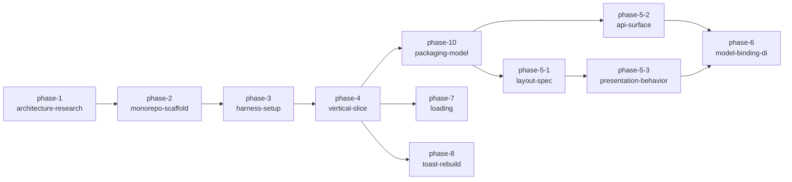

# KsDialogs ライブラリ基盤ロードマップ

AiForms.Maui.Dialogs のコンセプトを継承し、Native (Swift/Kotlin) + MAUI + KMP の3形態で使えるダイアログライブラリとしてリビルドする立ち上げロードマップ。

## ゴール / 非ゴール

**ゴール:**
- 3形態 (Native / MAUI / KMP) すべてから利用できるライブラリ基盤 (モノレポ・ビルドルート・core 契約) の確立
- Dialog / Loading / Toast の主要機能の移植完了 (Toast は原典で Obsolete のため新実装で復活)
- アーキテクチャ・規約の ADR / concepts 整備と、Kasane ハーネスのプロジェクト実態への追随
- 配布モデルの確立とパッケージング — 4形態の配布単位・バージョン整合の設計 (phase-10) と、公開可能な成果物の生成・発行検証 (phase-11)。phase-4 の実測で配布モデルが core の API 表面設計 (登録 API の置き場所・リンク構造) を規定すると判明したため、非ゴールから昇格 (2026-08-15)

**非ゴール:**
- 配布の継続運用 (リリース CI・署名・公開レジストリの運用整備) — 本ロードマップは発行検証まで。運用整備は公開時に別途起こす
- 移植元との互換 shim — 仕様と実装パターンのみ継承する独立ブランド (KsSettingsView cross/0017 踏襲)
- 移植元コードのベタ移植 — 概念・API 形状・レイアウト計算アルゴリズムを継承し、実装は各形態で書き直す

## 前提 / 制約

- **参考リポジトリの位置づけ**: AiForms.Maui.Dialogs = 移植元 (機能・仕様の正。README 711行が仕様の一次情報源)、KsSettingsView = 同 AiForms シリーズリブランドの先例 (cross 規約・ADR の出典)、KsAppKMP = KMP アーキテクチャ知識と進め方の正。ローカルパスは concepts の reference-repositories.md (phase-3 で設置) に集約する
- **展開戦略は縦串スライス**: シンプルな Dialog 1本を phase-4 で Native + MAUI + KMP の全形態に貫通させてから、機能単位で肉付けする。最初から3形態を掲げる本プロジェクトでは「後から KMP を載せたら core 契約が合わなかった」が最大の失敗リスクであり、細い縦串で先に潰す (KsSettingsView phase-1-native-bridge の LabelCell 縦疎通が同発想の成功例)。却下案 — A. Native 先行完成→MAUI→KMP: 契約不整合の発見が最遅になる / B. KMP 先行: MAUI binding のリスクが最後発に残る
- **Sample は phase-4 以降常に並走**: Sample 構成とパリティ規約は最初の実物 (phase-4 の最小 Sample) と同時に確定し、以降の全機能フェーズの完了条件に「パリティ準拠の Sample 通し」を含める
- **移植元の実装知識**: 本体約3,900行。多段表示は OS の提示機構への委譲で実現されており (明示的なスタック管理コードはない)、挙動としての多段表示は継承が前提。結果通知 (DialogNotifier) と View 再利用は MAUI 機構依存のため各形態で再設計する

## 全体図

phase-11-packaging / phase-9-docs は 2026-09-04 に [package-distribution](../../package-distribution/roadmap.md) へ昇格した (配布モデル phase-10 の成果はそちらの前提)。

## フェーズ一覧

| ID | 状態 | 種別 | フェーズ詳細 | Change |
|---|---|---|---|---|
| phase-1-architecture-research | completed | research | [agenda](phases/phase-1-architecture-research/agenda.md) | — |
| phase-2-monorepo-scaffold | completed | change | [agenda](phases/phase-2-monorepo-scaffold/agenda.md) | [add-monorepo-scaffold](../../changes/archive/2026-08-14-add-monorepo-scaffold/proposal.md) |
| phase-3-harness-setup | completed | research | [agenda](phases/phase-3-harness-setup/agenda.md) | — |
| phase-4-vertical-slice | completed | change | [agenda](phases/phase-4-vertical-slice/agenda.md) | [add-vertical-slice](../../changes/archive/2026-08-15-add-vertical-slice/proposal.md) |
| phase-10-packaging-model | completed | research | [agenda](phases/phase-10-packaging-model/agenda.md) | — |
| phase-5-1-layout-spec | completed | change | [agenda](phases/phase-5-1-layout-spec/agenda.md) | [add-layout-spec](../../changes/archive/2026-08-19-add-layout-spec/proposal.md) |
| phase-5-2-api-surface | completed | change | [agenda](phases/phase-5-2-api-surface/agenda.md) | [expand-api-surface](../../changes/archive/2026-08-19-expand-api-surface/proposal.md) |
| phase-5-3-presentation-behavior | completed | change | [agenda](phases/phase-5-3-presentation-behavior/agenda.md) | [add-presentation-behavior](../../changes/archive/2026-08-22-add-presentation-behavior/proposal.md) |
| phase-6-model-binding-di | completed | change | [agenda](phases/phase-6-model-binding-di/agenda.md) | [add-model-binding-di](../../changes/archive/2026-08-25-add-model-binding-di/proposal.md) |
| phase-7-loading | completed | change | [agenda](phases/phase-7-loading/agenda.md) | [add-loading](../../changes/archive/2026-08-26-add-loading/proposal.md) |
| phase-8-toast-rebuild | completed | change | [agenda](phases/phase-8-toast-rebuild/agenda.md) | [add-toast](../../changes/archive/2026-08-28-add-toast/proposal.md) |
| phase-11-packaging | promoted | change | — | [→ package-distribution](../../package-distribution/roadmap.md) |
| phase-9-docs | promoted | change | — | [→ package-distribution](../../package-distribution/roadmap.md) |
