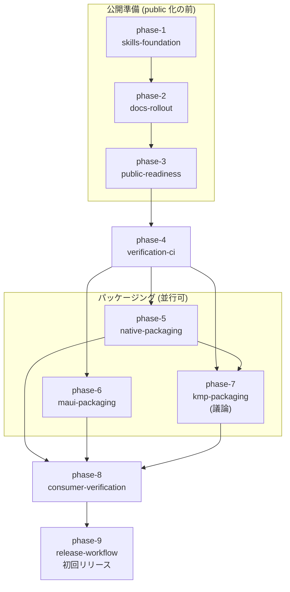

# パッケージ配信 (package-distribution)

KsDialogs の 4 形態 (Native iOS / Native Android / .NET MAUI / KMP) を公開レジストリへ lockstep で配信できる仕組み (利用者向け Skills・public 化・検証 CI・パッケージング・消費者検証・release workflow) を、姉妹ライブラリ KsSettingsView の実績を踏襲して整備し、初回リリースまで到達する。

library-foundation の phase-11-packaging / phase-9-docs を昇格して起案した (ksn-explore 2026-09-04、[exploration.md](exploration.md))。KsSettingsView は `../KsSettingsView/kasane/roadmaps/package-distribution/` で同じ範囲を 13 フェーズで完了し (2026-09-04 初回リリース `0.1.0-beta.1`)、その成果は「コピー + 固有値の差し替え」で本ロードマップへ逆流させる。踏襲できる論点は各フェーズの agenda に**解決済み論点 (決定事項)** として出典付きで直書きし、議論は KMP 形態と KsDialogs 固有の前提だけに絞る。

## ゴール / 非ゴール

### ゴール

- iOS (SwiftPM 配信リポジトリ `KsDialogs-SPM`)、Android (`jp.kamusoft:ksdialogs` / `ksdialogs-compose`)、MAUI (`KsDialogs.Maui`)、KMP (`jp.kamusoft:ksdialogs-kmp` + iOS アプリ側の SwiftPM 1 点) を公開レジストリから導入できる (cross/ADR-0008、maui/ADR-0004、kmp/ADR-0003)
- 単一 version で全形態を 1 回の手動起動で一斉リリースでき、tag は publish 全成功後にのみ生まれる (cross/ADR-0009、KsSettingsView cross/ADR-0020 の踏襲)
- 配布物を参照する消費者プロジェクト (`verification/`、4 形態) で配信経路が検証されている (publish 前の dry-run と publish 後の smoke)
- ブランチの役割に合わせた検証 CI がある (KsSettingsView cross/ADR-0025・0026・0028 の踏襲)
- リポジトリが public である (機密情報・個人情報の混入チェック後、新規リポジトリへ単一 initial commit)
- 利用者向けドキュメントが、利用者が自分のプロジェクトへコピーして使える Skills (`skills/`、英語 / 日本語の 2 版) として提供され、docs-refresh が manifest 方式の差分更新で kasane/concepts/ とコード・テストに追従させる道具になっている
- 英語 README + `README_ja` にインストール手順 (確定済み識別子、初回リリースまでは「未配信」の状態表記つき) と AiForms.Maui.Dialogs からの移行案内がある

### 非ゴール

- private 配信経路 (GitHub Packages 等)
- iOS の binary (xcframework) 配布 — 要望が出た時点で cross/ADR-0008 (2026-09-04 改訂) を見直す
- Android の module 統合 (KsSettingsView android/ADR-0016 は翻案しない。KsDialogs は android/ADR-0001 の 2 artifact を維持)
- ライブラリの機能追加。配布物で API を固める前に済ませる小修正 (`BG8401`・`DialogException` 合流) だけを phase-6 に同梱する
- 共有 workflow 化 (別リポジトリの workflow を両ライブラリから `uses:` する形) — KsSettingsView phase-8 で却下済み
- `skills/` と README 群の自発更新 (docs-refresh はユーザーの明示依頼で起動する)
- Skill の配布パッケージング (plugin / marketplace 形式)
- Kasane (開発ハーネス側) のスキルやその配布の変更

## 前提 / 制約

- 設計の正は ADR 群: cross/0008 (SwiftPM 節は 2026-09-04 改訂)・0009、kmp/0003、maui/0004 (proposed のものは各フェーズの蒸留時に accepted へ昇格)。KsSettingsView 側の ADR (cross/0018〜0028、maui/0025) は翻案元として各 agenda の決定事項から参照し、KsDialogs 側で ADR 化するか既存 ADR の改訂で済ませるかはフェーズごとに蒸留時に決める
- SwiftPM は monorepo を直接解決させず、SwiftPM 専用の配信リポジトリ `KsDialogs-SPM` へ release CI が `ios/` (Package.swift / Sources / Tests) のスナップショットを commit し同じ version の tag を push する (cross/ADR-0008 (2026-09-04 改訂))。monorepo のルートに Package.swift は置かない
- 実行順は KsSettingsView と同じ制約に従う: 利用者向け文書 (phase-1・2) の完成は public 化 (phase-3) より前 (公開履歴に旧文書を載せない) / public 化は CI 構築 (phase-4) より前 (public なら macOS ランナー無料・SwiftPM の https 実リモート検証が可能)
- KsDialogs は現在 git remote なし・CI なし・`main` 直コミット運用。ブランチモデル (KsSettingsView の `develop` / `main` 2 本を踏襲するか `main` 1 本か) は phase-3 で決める
- 版の表現: 開発用既定値は SNAPSHOT / dev、リリース version は dispatch 入力で CI が注入する。prerelease は `X.Y.Z-{alpha|beta|rc}.N` (`-pre` / `-preview` は Maven の版比較で正式版より新しいと判定されるため使わない)
- `jp.kamusoft` の Maven Central 名前空間検証は KsSettingsView phase-5 で完了済み (2026-09-01) で共用できる。nuget.org の Trusted Publisher Policy・GitHub Environment `release`・配信リポジトリの deploy key は repo 単位のため KsDialogs で別途作る
- 知識の正は `kasane/concepts/` とコード・テスト。`skills/` はそこから利用者向けに翻訳した派生物で手で直接育てない。Skill の形式は Agent Skills 標準 (`SKILL.md` + frontmatter、必要なら `references/`)
- 逆流元の実測値 (Xcode 26.5・MAUI 本体下限 10.0.70・toolchain 版・所要時間) は KsSettingsView 固有。KsDialogs では着手時に実測し直す

## 全体図

phase-1 → 2 → 3 (public 化) → 4 (CI) の後、phase-5 / 6 / 7 は並行可 (phase-7 の publish 参照は phase-5 の配信リポジトリ配置に依存する)。phase-8 は 3 つの packaging が揃ってから、phase-9 は phase-8 の消費者検証 workflow を artifact 経由で呼ぶため最後。

## フェーズ一覧

| ID | 状態 | 種別 | フェーズ詳細 | Change |
|---|---|---|---|---|
| phase-1-skills-foundation | completed | change | [agenda](phases/phase-1-skills-foundation/agenda.md) | [adopt-docs-refresh](../../changes/archive/2026-09-04-adopt-docs-refresh/proposal.md) |
| phase-2-docs-rollout | completed | change | [agenda](phases/phase-2-docs-rollout/agenda.md) | [rollout-user-docs](../../changes/archive/2026-09-05-rollout-user-docs/proposal.md) |
| phase-3-public-readiness | completed | research | [agenda](phases/phase-3-public-readiness/agenda.md) | — |
| phase-4-verification-ci | in-progress | change | [agenda](phases/phase-4-verification-ci/agenda.md) | [add-verification-ci](../../changes/add-verification-ci/proposal.md) |
| phase-5-native-packaging | pending | change | [agenda](phases/phase-5-native-packaging/agenda.md) | — |
| phase-6-maui-packaging | pending | change | [agenda](phases/phase-6-maui-packaging/agenda.md) | — |
| phase-7-kmp-packaging | pending | change | [agenda](phases/phase-7-kmp-packaging/agenda.md) | — |
| phase-8-consumer-verification | pending | change | [agenda](phases/phase-8-consumer-verification/agenda.md) | — |
| phase-9-release-workflow | pending | change | [agenda](phases/phase-9-release-workflow/agenda.md) | — |
